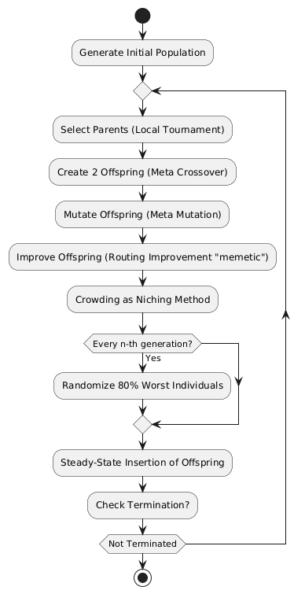

# Steady-State Memetic Genetic Algorithm  

This project implements a **Steady-State Memetic Genetic Algorithm** to solve a constrained version of the **Vehicle Routing Problem** (VRP). The objective is to optimize **nurse scheduling** by minimizing total travel time while considering constraints like time windows, workload capacity, and specified depot return times. By combining **steady-state evolution** with **local search heuristics**, the algorithm enhances route optimization efficiency.  

## 🚀 Running the Project
This project requires no additional setup and is ready to run out of the box. To execute the program, use:

```sh
cargo run --release
```

Model parameters and datasets can be adjusted in `main.rs` as needed.

## 🧠 Algorithm Overview 
The Genetic Algorithm follows these key steps:  

  

After termination, runtime statistics and the final solution score will be written to the output file.

## 📖 Documentation 

This project uses **rustdoc** for automatic documentation. To generate and open the documentation, run:  

```sh
cargo doc --open
``` 
Your documentation will then be generated and automatically open on your preferred browser.

## 📂 Project Structure  
The project is **modular**, with components categorized as **Genetic Algorithm modules, Structs, and Utilities**


### 🧬 GA Components  
The Genetic Algorithm is divided into modular files:  
- **generate_population.rs** – Initializes candidate solutions.  
- **fitness.rs** – Evaluates solutions based on constraints.  
- **selection.rs** – Selects the best solutions for reproduction.  
- **crossover.rs** – Merges parent solutions to generate offspring.  
- **mutation.rs** – Introduces variations to maintain diversity.  
- **route_improvements.rs** – Applies local search heuristics to refine solutions.  
- **evolutionary_algorithm.rs** – Manages the full optimization process.  

### 🏗 Structs  
The project defines four core **structs**:  
- **Depot** – Represents the start and end location.  
- **Instance** – Stores problem-specific data.  
- **Nurse** – Models an individual worker with constraints.  
- **Patient** – Represents a service location with scheduling needs.  

### 🔧 Utilities  
Helper functions for file handling, parsing, and visualization:  
- **create_file.rs** – Manages output file generation.  
- **mod.rs** – Handles module imports.  
- **parse_data.rs** – Reads and structures input data.  
- **plot_map.rs** – Visualizes route solutions.  
- **plot_metrics.rs** – Tracks performance over generations.  
- **score_recorder.rs** – Logs solution fitness over time.  
- **textual_answer.rs** – Formats output in a readable way.


## 👥 Authors and Contribution
This project was a **collaborative effort**, with all team members contributing equally.  